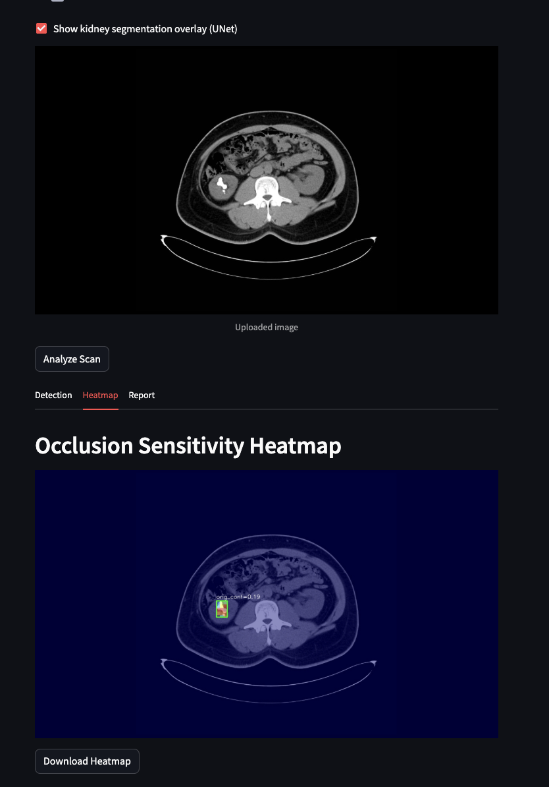
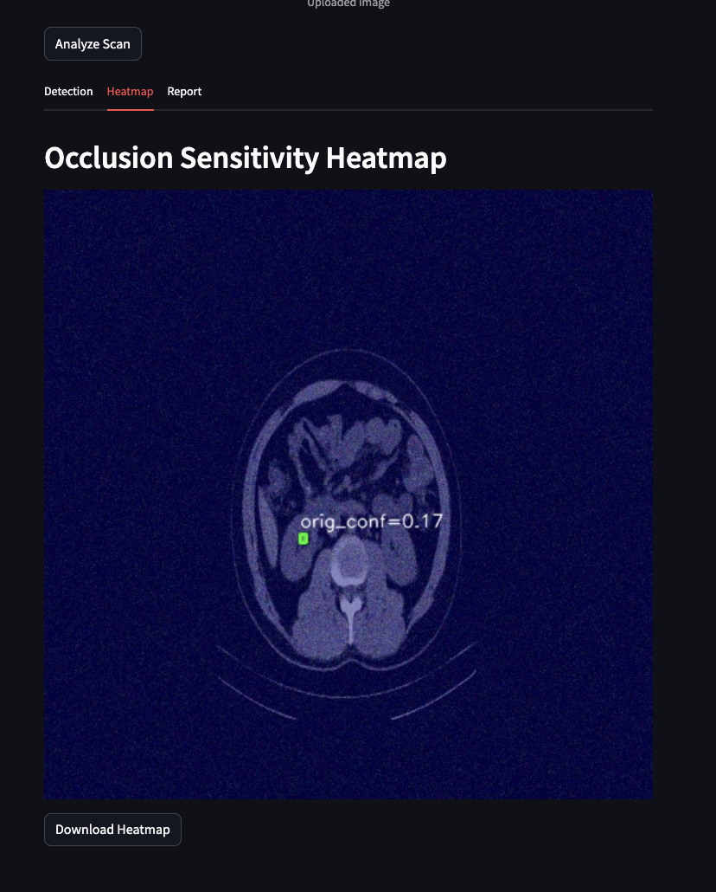
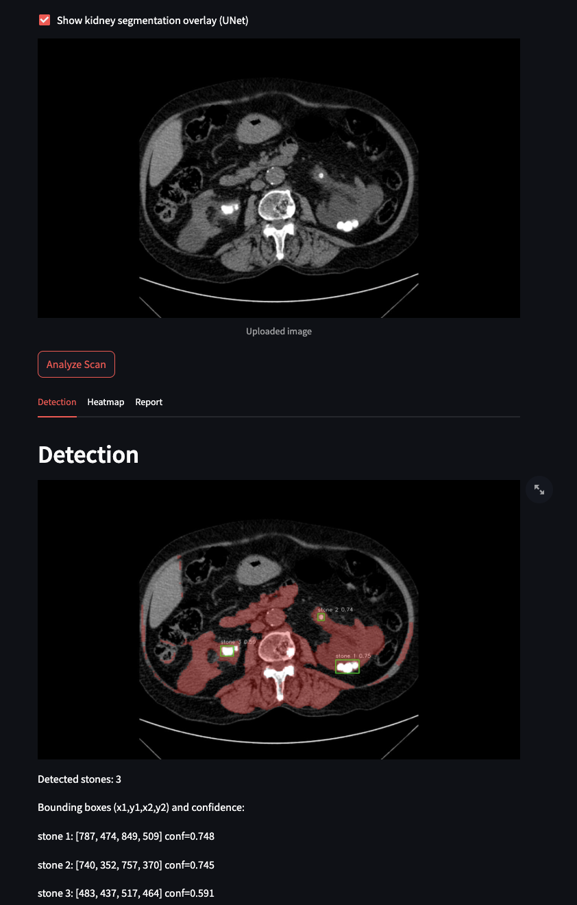

# 🩺 KidneyStoneX

**An End-to-End AI-Driven CT Kidney Stone Detection, Segmentation & Explainability System**

---

## 📌 Overview

KidneyStoneX is a full-stack medical imaging AI project that recreates a **realistic radiological workflow** for detecting kidney stones from CT axial slices. Instead of focusing on a single model or benchmark score, this project emphasizes the **entire AI pipeline** — from raw data and annotation challenges to model training, explainability, quantification, and deployment as a web application.

The system is designed as a **clinical decision-support prototype**, intended to assist radiologists by highlighting findings, visualizing anatomical context, and generating structured diagnostic summaries — **not** to replace human expertise.

---

## 🩻 Clinical Motivation

Kidney stone disease is a widespread clinical condition that often presents with acute pain and requires rapid diagnosis. **Computed Tomography (CT)** is the gold standard imaging modality for stone detection due to its high spatial resolution and sensitivity.

However:

* Manual inspection of CT slices is time-consuming
* Very small stones (few pixels wide) are easy to miss
* Interpretation quality depends heavily on radiologist experience

KidneyStoneX explores how AI can **augment** this process by automating detection, providing visual explanations, and summarizing findings in a structured format.

---

## 🧠 System Architecture

```
CT Axial Slice
   ↓
YOLOv8 (Stone Detection)
   ↓
U-Net (Kidney Segmentation – Optional)
   ↓
Occlusion Sensitivity Heatmap (Explainability)
   ↓
Quantification (Count, Area Proxy, Intensity Proxy, Side)
   ↓
Automated Diagnostic Report
```

Each module is independent and modular, allowing the pipeline to run with or without segmentation and explainability depending on performance constraints.

---

## 🔍 Core Components

### 1️⃣ YOLOv8 Stone Detection

* Detects renal stones using bounding boxes
* Trained using a **positive-only training paradigm**
* No explicit non-stone class
* Final model trained on manually verified annotations
* Robust against false positives after correction of vertebral mislabels

### 2️⃣ U-Net Kidney Segmentation (Optional)

* Lightweight Simple U-Net architecture
* Segments kidney anatomy for spatial context
* Not used for stone detection
* Optional due to higher computational cost

### 3️⃣ Explainability: Occlusion Sensitivity

* Grad-CAM and SHAP were evaluated and rejected
* Final explainability uses **occlusion sensitivity**
* Measures confidence drop when image patches are masked
* Causal, pixel-level, and well-suited for small medical objects

### 4️⃣ Quantitative Analysis

For each CT slice, the system extracts:

* Number of detected stones
* Average bounding box area (pixel proxy)
* Mean pixel intensity (approximate HU proxy)
* Left / Right kidney localization

> ⚠️ Pixel values are **not converted to millimeters or true Hounsfield Units** due to missing DICOM metadata. This limitation is explicitly stated in reports.

### 5️⃣ Automated Diagnostic Report

A structured radiology-style report is generated, including:

* Findings
* Impression
* Recommendations
* Clinical disclaimers

---

## 🖥️ Demo Screenshots (To Be Added)

> 📸 **Placeholder** — You can add screenshots here later

```md
<!-- Example -->






```
---
## 📁 Project Structure

```
KidneyStoneX/
│
├── data/
│   └── images/                 # Input CT slices
│
├── models/
│   ├── yolo_stone.pt           # Trained YOLOv8 detector
│   └── unet_kidney.pth         # Trained U-Net segmenter
│
├── pipeline/
│   ├── models.py               # Model loaders
│   ├── detect.py               # YOLO inference
│   ├── segment.py              # U-Net inference
│   ├── explain.py              # Occlusion heatmap
│   ├── quantify.py             # Metrics extraction
│   └── report.py               # Diagnostic report generation
│
├── app.py                      # Streamlit web application
├── requirements.txt
└── README.md
```

---

## ⚙️ Installation (Local / VS Code)

### 1️⃣ Create and activate a virtual environment

```bash
python -m venv venv
```

**Windows**

```powershell
.\venv\Scripts\Activate.ps1
```

**macOS / Linux**

```bash
source venv/bin/activate
```

---

### 2️⃣ Install dependencies

```bash
pip install -r requirements.txt
```

Tested with:

* Python 3.9+
* PyTorch
* Ultralytics YOLOv8
* OpenCV
* Streamlit

---

## ▶️ Running the Application

```bash
streamlit run app.py
```

The web interface allows you to:

* Upload a CT image
* Toggle kidney segmentation
* View detected stones
* Inspect occlusion heatmaps
* Read the generated diagnostic report

---

## 🧪 Dataset Notes

* Public CT kidney stone dataset (Mendeley)
* Original and augmented images explored
* Final training used **clean, manually verified subsets only**
* Extensive dataset filtering required due to:

  * Incorrect auto-annotations
  * Vertebral false positives
  * Mask leakage issues

Data quality was prioritized over dataset size.

---

## ❌ Why Grad-CAM & SHAP Were Not Used

| Method   | Reason for Rejection                                                                         |
| -------- | -------------------------------------------------------------------------------------------- |
| Grad-CAM | YOLO’s multi-head detection architecture does not produce stable gradients for small objects |
| SHAP     | Computationally expensive and unstable for pixel-dependent medical images                    |

**Occlusion sensitivity** was selected because it is causal, model-agnostic, and clinically interpretable.

---

## ⚠️ Clinical Disclaimer

> This project is a **research and educational prototype**.
> It is **not approved for clinical use** and must not be used for diagnosis or treatment decisions.
> All outputs require review by qualified medical professionals.

---

## 🎯 Project Philosophy

KidneyStoneX is intentionally built as a **full medical AI workflow**, not a benchmark-only model. The project reflects:

* Real-world data issues
* Iterative failures and corrections
* Importance of explainability
* Practical deployment considerations

---

## 👨‍💻 Author

**Suryesh Pandey**
B.Sc. (Computing)
AI / ML | Medical Imaging | Applied Deep Learning

---

## 📌 Future Work

* DICOM-based measurement using pixel spacing
* Multi-slice (3D) analysis
* Stone composition classification
* PACS integration simulation
* Clinical user studies
